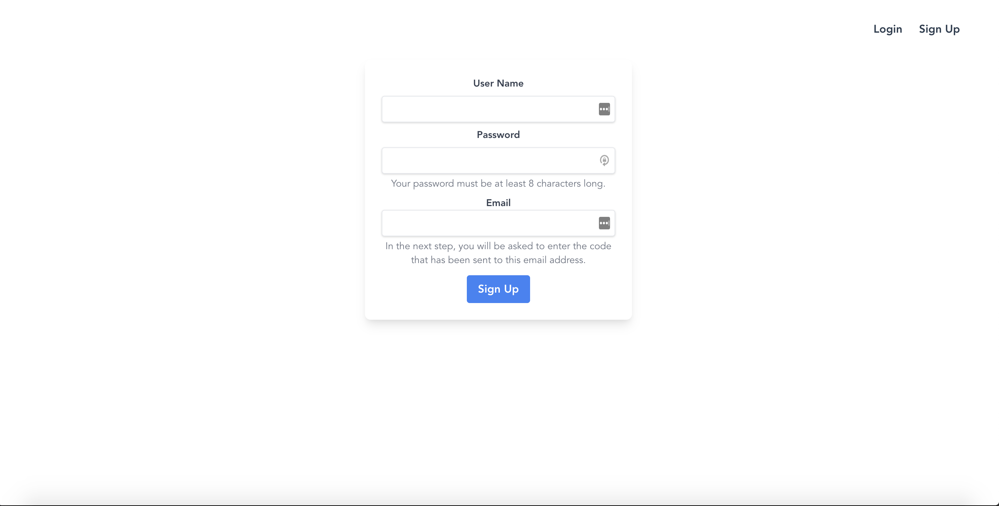
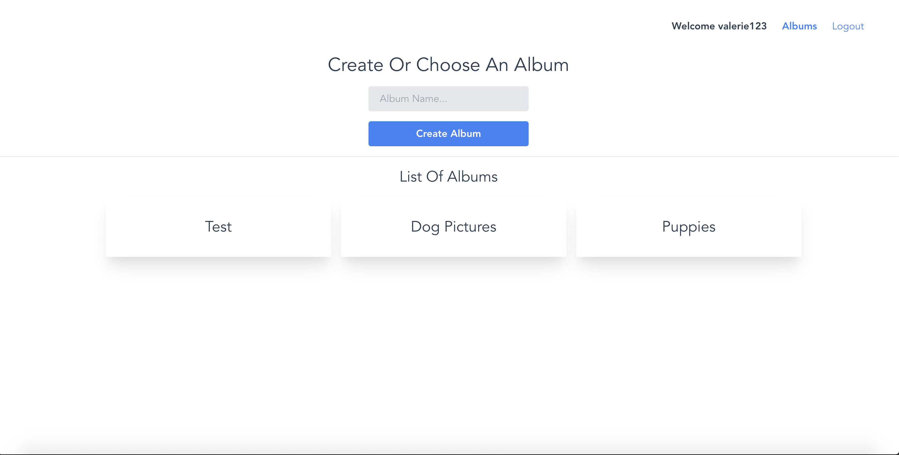
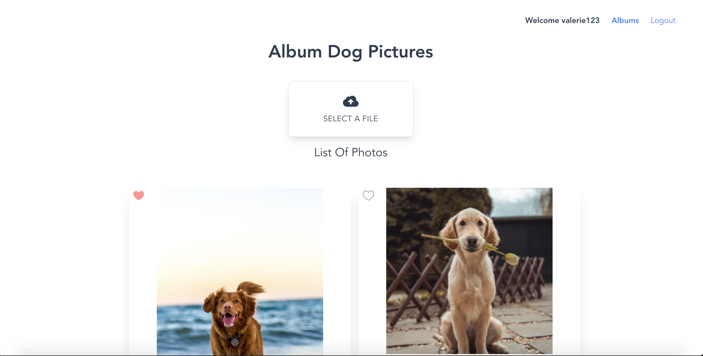

# Photobook

The base of this project was made by following the tutorial 'Full Stack Photobook App | Vue, GraphQL, AWS Amplify' by Erik Hanchett on [YouTube](https://www.youtube.com/watch?v=w0p7ywfHesw&ab_channel=TraversyMedia). It was bootstrapped with [Vue CLI](https://cli.vuejs.org/). It is a full stack app built with Vue.js, TailwindCSS, GraphQL& AWS Amplify. 

     

     
Using the app requires authentication. The user can login or sign up, which creates a new user in AWS Cognito. After logging in, the user can view and create an album. Once created, the album can be clicked, which redirects to a detail page. There, the user has the possibility to add photos.

A feature that was added to this basic app is the ability to mark a photo as 'favorite' by clicking a heart. Moreover, I've added a loading spinner that indicates a running internal process. 

## Available Scripts

In the project directory, you can run:

### `yarn install` or `npm install` 

Installs the dependencies in the local node_modules folder.

### `yarn run serve` or `npm run serve`

Runs the local development server. 
Open [http://localhost:8082](http://localhost:8082) to view it in the browser.

The page will reload if you make edits. 

## Future improvements, features and fixes

- Building an error toast or modal to give the user feedback when a process errors out;
- Expand the app with other CRUD functionalities, like editing album names, deleting albums and photos, etc.
- A nice major feature would be a sharing option to immediately share the image to social media;
- A drag and drop area for file uploads;
- Write unit tests;
- Custom form validation for the login and signup pages.
